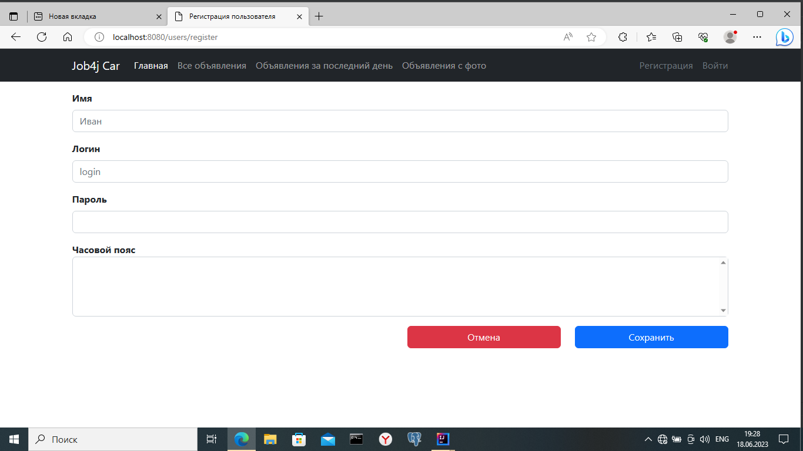
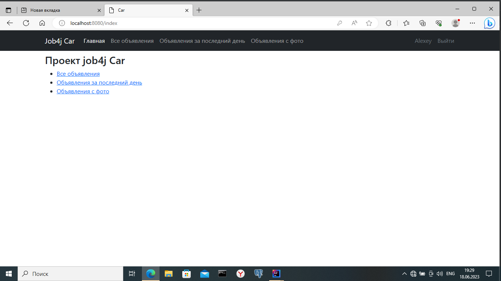

В этом учебном приложении разработан сайт по продаже автомобилей.
На сайте размещены объявления. В объявлении должно быть: описание, марка машины, тип кузова, фото.

Объявление имеет статус продано или нет.

## Стек технологий
- Java 17
- Spring Boot 2.7.6
- Maven 3.8
- Git
- Lombok 1.18.22
- Hibernate 5.6.11
- Liquibase 4.15
- PostgreSql 42.5.1

## Требования к окружению

- **Java 17**
- **Maven 3.8**
- **PostgreSql 14**

## Сборка и запуск<br>

**Cоздать базу данных**

 ``` shell 
create database cars;
```
- **Запустить проект по команде**
-
``` shell 
mvn spring-boot:run
```


## Взаимодействие с приложением.

Стартовая страница с полями для регистрации.


Страница с регистрацией пользователя. 


На главной странице выведена общая информация о ресурсе.


На странице выведен список всех объявлений.
Для добавления нового объявления необходимо выбрать "Добавить объявление"


Страница создания объявления.


Страница редактирования объявления.


Отображение страницы при отсутствии объявлений по выбранным фильтрам.


## Контакты для связи<br>
> Связаться со мной [TELEGRAM](https://t.me/AlekseyNovoselov/).